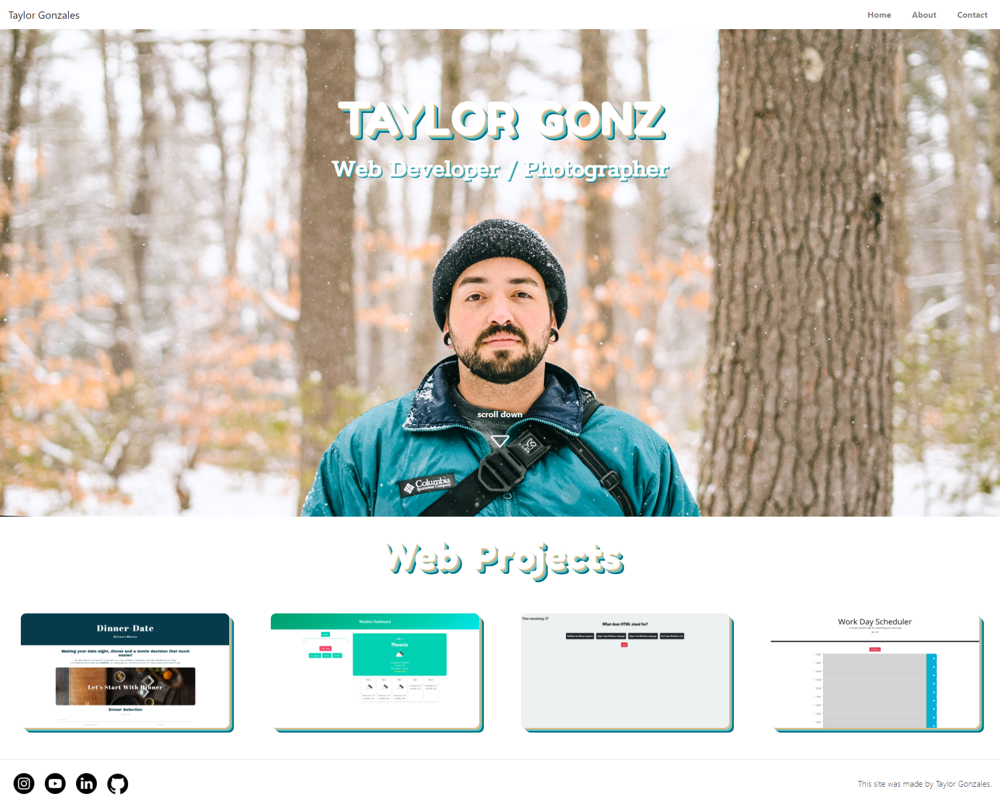
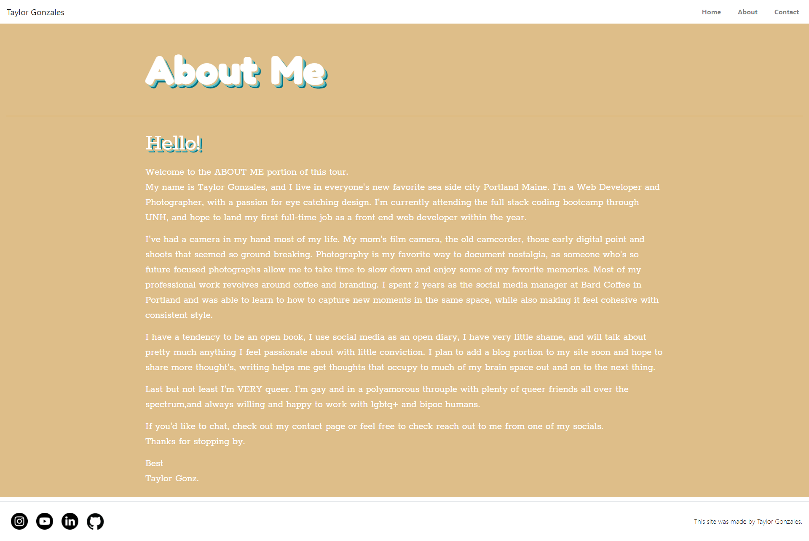
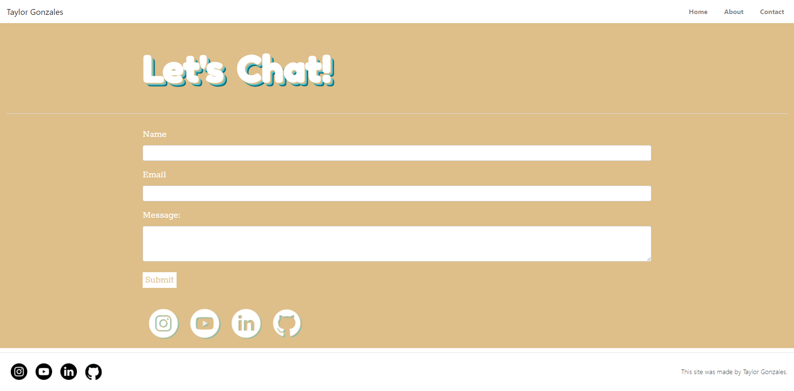

# taylorgonz.github.io

# Portfolio

Welcom to my portfolio! I took this on as a my first React project and had a lot of fun with it.

deployed site [here](https://taylorgonz.github.io/)

Below I have a screenshots of the Website.

## Usage
Simple Portfolio page built with create-react-app
 - React
 - React-spring
 - React-router
 - CSS
 - Form Spring
 

## Credits
Credit to [Mike Fearnley](https://michaelfearnley.com/) and [Scott Byers](https://github.com/switch120)

and the UNH Fullstack Coding Bootcamp

## Links 
Here is the link to the deployed site: https://taylorgonz.github.io

## Contact

if you want to contact me for any more questions here are my links!

hello@taylorgonz.com
 
[Website](http://www.taylorgonz.com)

## Socials
- [Linked In](https://www.linkedin.com/in/taylorgonz/)
- [GitHub](https://github.com/Taylorgonz)

## Licensing
 [General Public License](https://opensource.org/licenses/GPL-2.0)